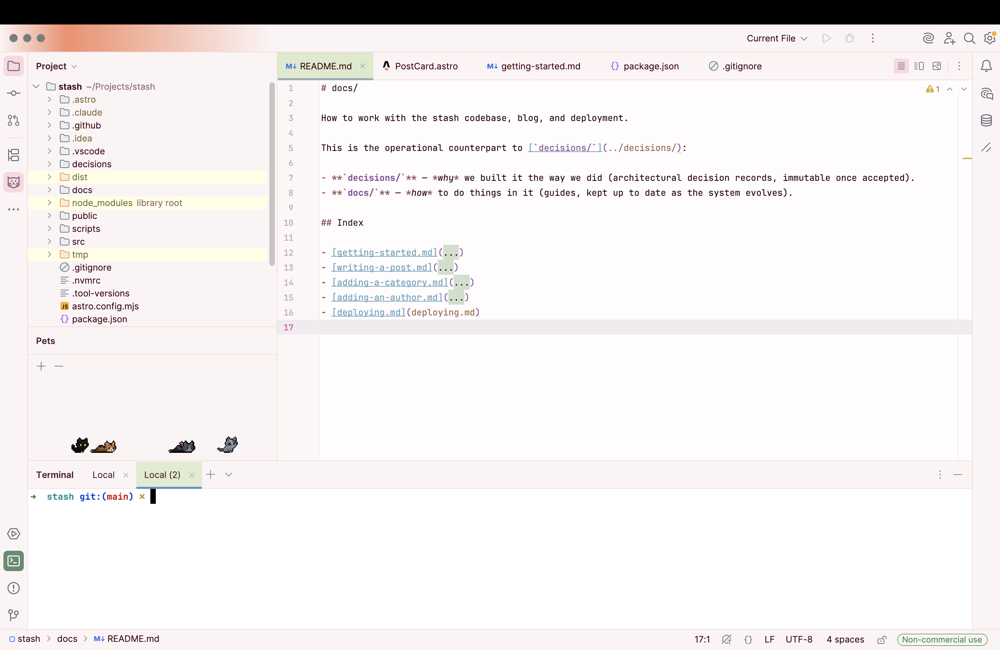
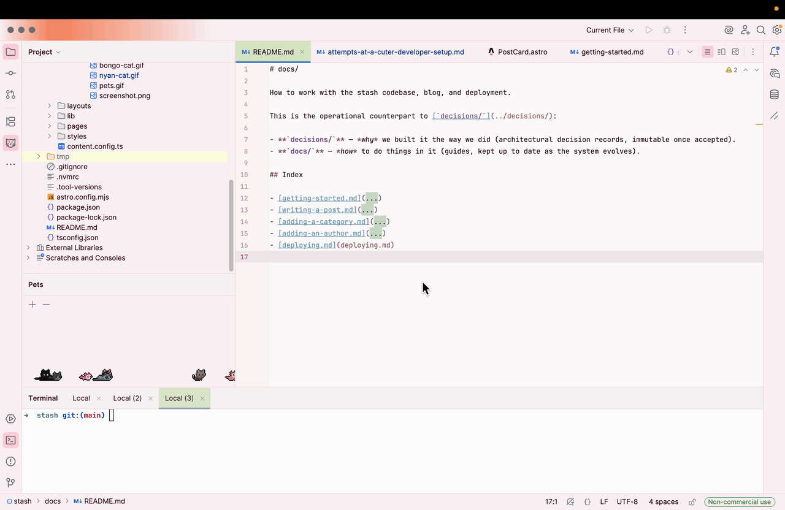
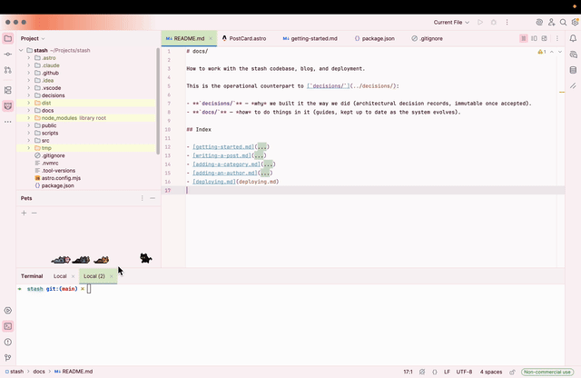
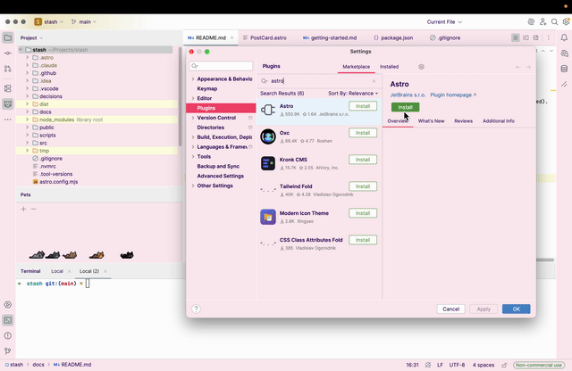

I want to target several areas of my setup, in no particular order: IDE, terminal, desktop, general Mac aesthetic, even my desk (and maybe my room?).

The first edition is all about my IDE since that is where I spend most of the time.. reading Claude’s code. Haha. Thankfully I still write and edit code for a fair amount of time, so who says I can’t have a bongo cat typing along with me? 🐱

# The vibe

1. **Light mode**: don’t come at me but I find light mode easier to read and more relaxing, especially on IDEs  
2. **Kawaii**: think pastels, cute animals, sparkles, the works 💖  
3. Basically anything that is even mildly cute lol

But hey, this is what I’m feeling at this moment. Maybe a few months down the line, I might want a crazy techno theme 🤷🏻‍♀️

# The setup

I use Jetbrains IDEs (PyCharm, WebStorm, IntelliJ), and I used Google \+ Claude to find suggestions, to varying degrees of success. Let’s get down to the brass (or rather pastel) tacks\!

## Area 1: Theme

This proved to be unnecessarily tricky, given my requirements. I really wanted something in purple but unfortunately all purple themes are violently dark :(  
Although I will highly recommend fairyfloss \- it is a beautiful dark purple theme and will be my go-to if and when I ever switch back to dark mode\!

The winner: **[Sakura](https://plugins.jetbrains.com/plugin/22872-sakura-theme)**

Other considerations:

1. **[Cute Pink Light](https://plugins.jetbrains.com/plugin/16721-cute-pink-light-theme)**: a very close second  
2. **[Catppuccin Latte](https://plugins.jetbrains.com/plugin/18682-catppuccin-theme)**: idk what kind of marketing these guys have done but these Catppuccin themes pop up in every single recommendation. It was too white/stark for me  
3. **[Mocha Mouse Light](https://plugins.jetbrains.com/plugin/26136-mocha-mouse-light-theme)**: found it to be really beautiful and warm, saving this for a chocolatey-themed setup in the future\! 🍫

..and other themes that I don't care to remember at this point.

## Area 2: Font

The default JetBrains Mono is a beautiful font. No notes.

## Area 3: Editor

**Rainbow Brackets**: for some reason I can’t get it to work anymore  
**[Rainbow Indent](https://plugins.jetbrains.com/plugin/13308-indent-rainbow)**

And my favourite \- **[Bongo Cat](https://plugins.jetbrains.com/plugin/27913-typing-bongo-cat)**\! Need I say more? I may get annoyed with this soon but for now, it makes me chuckle!

## Area 4: Cuties

I wanted one of those baby animals that pop up in your status bar or toolbar and do random things like wave, say stuff etc And I did find some that hit the mark perfectly\!

### Pets

[**Pets**](https://plugins.jetbrains.com/plugin/21008-pets) - they hang out with each other, play and groove to a tune that only they can hear. You know that fuzzy feeling you get when you watch cat videos? This is that, but a lightweight, portable, low-res, v0.1 version of it 🐱🐶🐰

### Nyan Cat Loader

Indexing a big project? No worries, [**Nyan Cat**](https://plugins.jetbrains.com/plugin/8575-nyan-progress-bar) is here to give you company. Pycharm hogging your RAM and still refusing to load files? Nyan Cat is working hard to get it to behave. Installing a plugin? Nyan Cat is there to approve it 🌈

That’s all for this edition! 🩷  
Tip for the noobs like me: sign in to Jetbrains to sync your settings across all your IDEs so that every project has that cutesy goodness out-of-the-box :)
