TLDR: I made a mac app which enables samsung DeX on a mac through USB debugging. Check it out here [github.com/abhishekmsingh/SamDex](http://github.com/abhishekmsingh/SamDex/tree/main).
I couldn't bundle this into a mac app on app store as I dont wanna pay the developer fee, please follow the instructions in the repo to start the app on your mac!

# What was the problem

A lot of times I just want to sit comfortably at my desk and do some personal stuff with focus. Look at my finances, go through my mails, develop some personal projects etc etc. My desk has a nice 27inch monitor connected to my personal macbook air, an 8bitdo keyboard and a comfy logitech mouse, it makes for a good productive setup.

<!-- 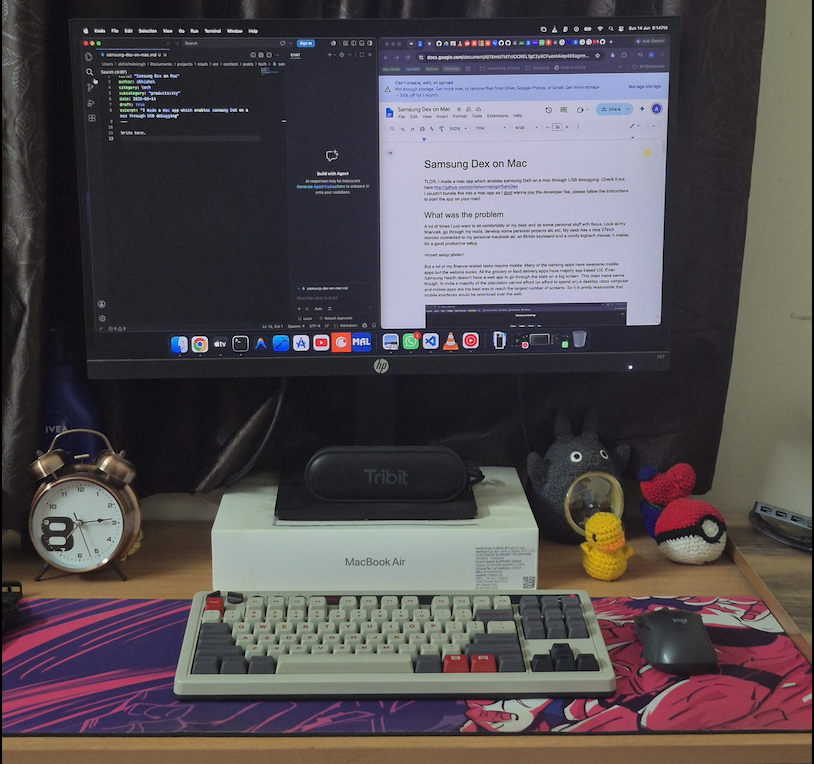 -->

But a lot of my finance related tasks require mobile. Many of the banking apps have awesome mobile apps but the website sucks. All the grocery or food delivery apps have majorly app based UX. Even Samsung Health doesn't have a web app to go through the stats on a big screen. This does make sense though; In India a majority of the population cannot afford (or afford to spend on) a desktop class computer and mobile apps are the best way to reach the largest number of screens. So it is pretty reasonable that mobile interfaces would be prioritized over the web.

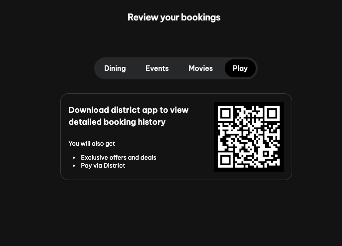
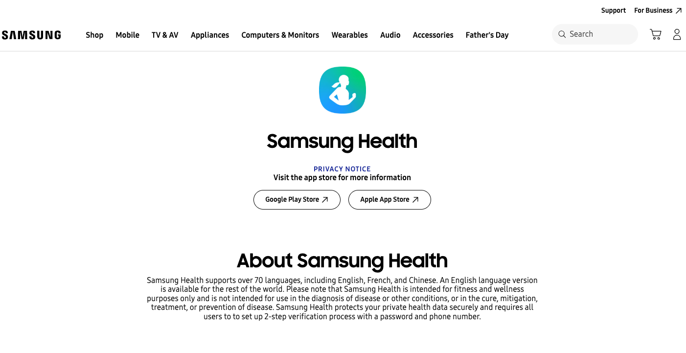

For me, I would really want each app to be translated to an equally good desktop app/website. I just love doing my tasks on a big screen, mobile screens just don't feel productive enough. Sounds like a first world problem? It kinda is, in India atleast. But this is a problem that Apple has tackled with a custom app that [lets you access your iphone on your mac](https://support.apple.com/en-in/120421) so you don't need to leave the productive mac setup to tackle a few mobile only tasks.

But what about my samsung phone and my macbook air? I like Apple laptops but still prefer android phones due to their open developer ecosystem. I also want to operate and view my samsung phone through my mac!

# What I wanted

I started to search for a solution to my problem, but there is no “one button” app to just let my samsung phone be accessible on a mac. You can tinker around with [`scrcpy`](https://github.com/genymobile/scrcpy) and [`adb`](https://developer.android.com/tools/adb) to make it work but it is too developer-ish. I am a developer so it's fine for me but I wanted to make that “one button” solution.

We can do even better than Apple here, my samsung phone supports [Samsung DeX](https://www.samsung.com/us/apps/dex/) (I have a Samsung S24FE), which enables a desktop UI when plugged onto external screens. The UI allows us to open multiple apps at once on the screen, resize them and all the desktop stuff. A mac is not an external screen so we would need to do some trickery there. But the idea is to plug my phone to my mac through USB and then access my phone on the mac in desktop mode. It will be the most productive form of it!

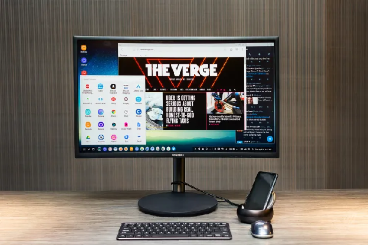

# What was the solution

While researching on the topic, I went through a lot of reddit articles and finally landed on [this](https://lefkatis.substack.com/p/how-to-use-dex-without-the-windowsmac) article. The article uses `adb` and `scrcpy` to mirror an android phone on mac and then recommends a dummy hdmi adapter to fool the system into thinking that the connection is a display connection so that the output becomes DeX. I did not want to buy an adapter! but still I went ahead and followed the article to see what was possible.

Through the commands I was able to mirror the phone and use it in portrait.

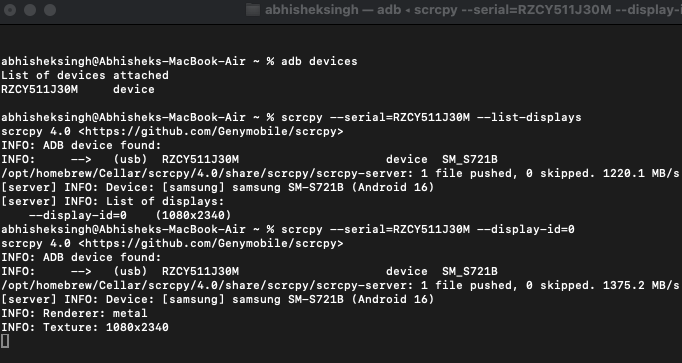
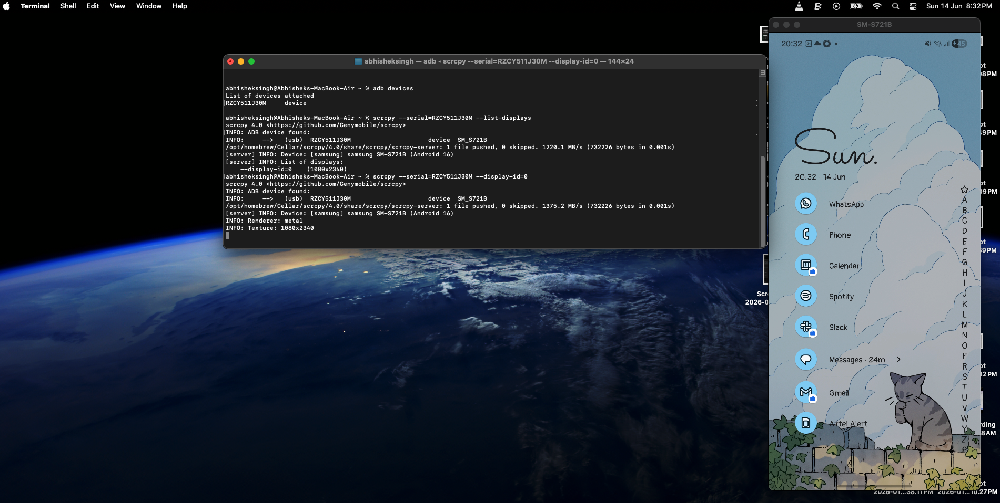

But I wanted DeX, so I went to the debugging options to see if there was a setting that I could use and then I stumbled upon the “Simulate secondary displays” option. If Samsung treats this as an external display then Samsung DeX would be on this screen. Bingo! This was an accidental jackpot!

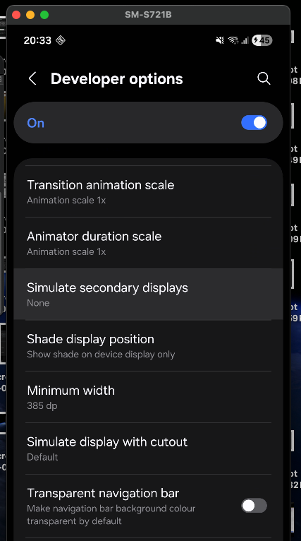

I turned it on and searched for a way to project that display on my mac using `scrcpy`.

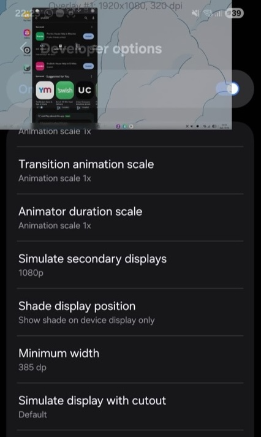

It was a success! I was able to tap into the secondary display as Samsung Dex.

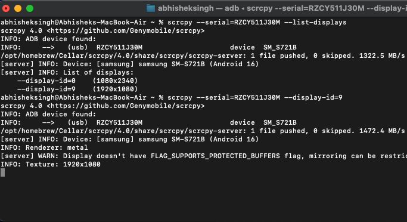

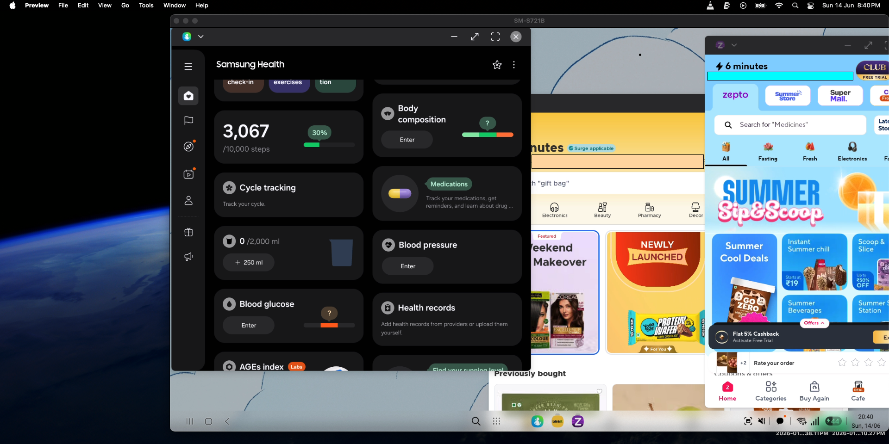

Note: *The minimum width of the secondary display when I was doing this initially was pretty large so the apps would not scale well. The images above are after I decreased the minimum width of the display using ADB. I don't know how to revert it so that I can share how it looked but it wasn't well scaled*

So, now the only step left was to make the minimum width of the external display big enough for apps to scale well. I searched the adb docs for a command to simulate secondary displays in a certain resolution/width, and indeed it was possible. So finally, I simulated a secondary display in 1080p, on which the samsung phone did start DeX and then I used `scrcpy` to grab the display. To my surprise it worked! And it worked as I had intended.

To make the “one button” solution I prompted Claude to bundle all these commands to a mac app. It lives on the menu bar and gives easy access to the user for starting a DeX session on their Mac.

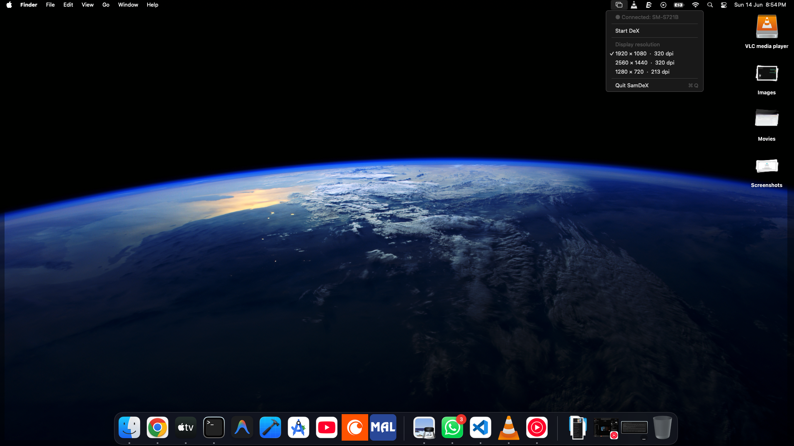
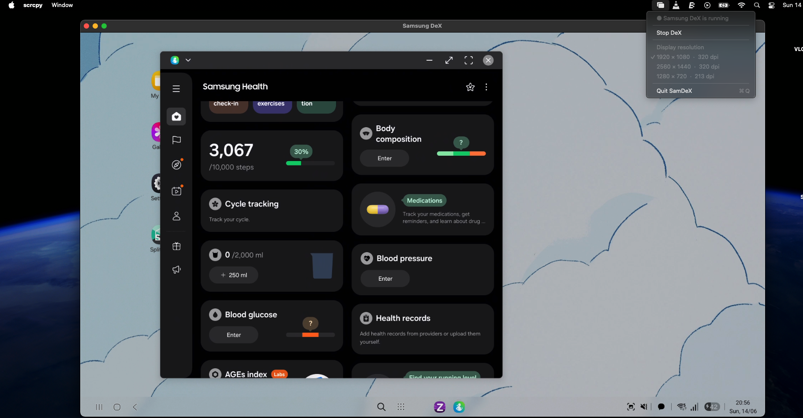

A GIF of how this is working 
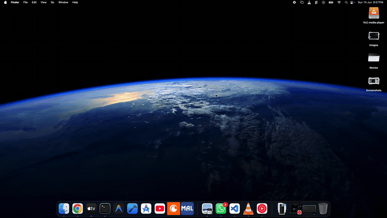

And thus I was able to use my Samsung in DeX mode on my Macbook. I know this might not be the biggest problem out there, but I was pretty happy to make my life a little bit more productive! Please share to people you know who would like a similar setup.
